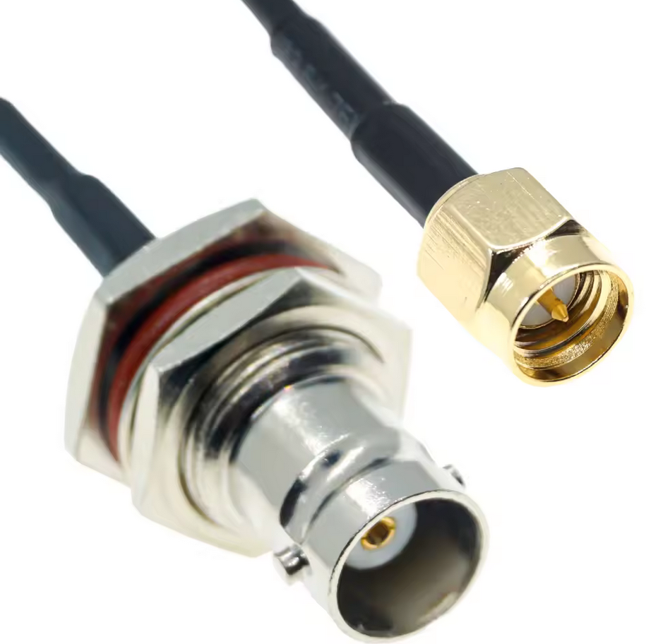
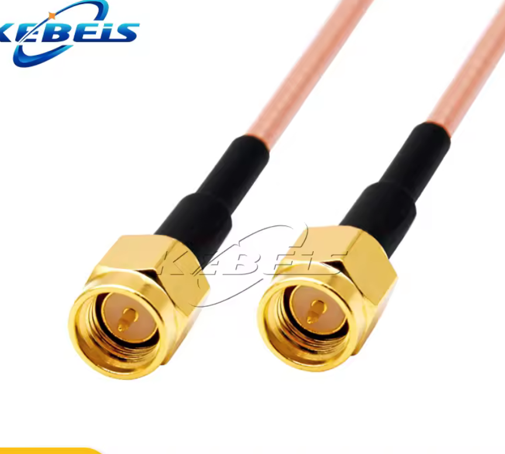
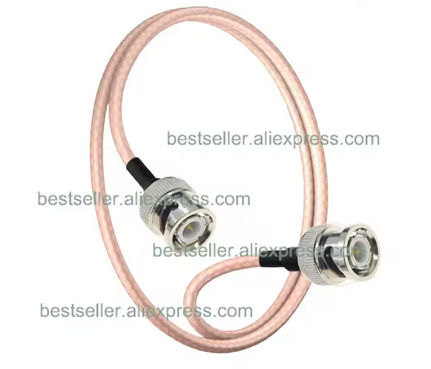
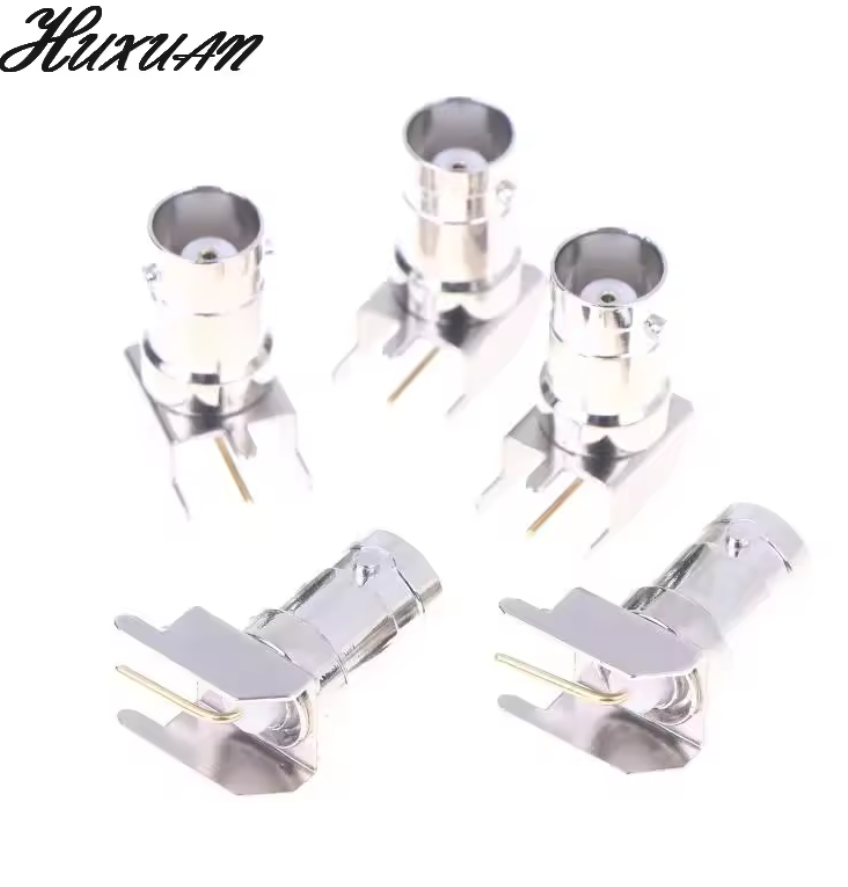
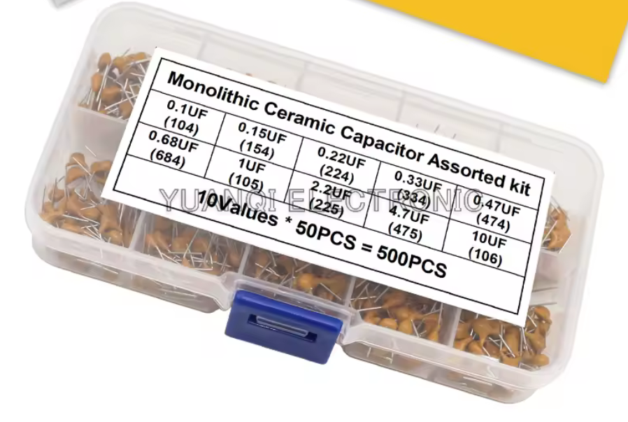
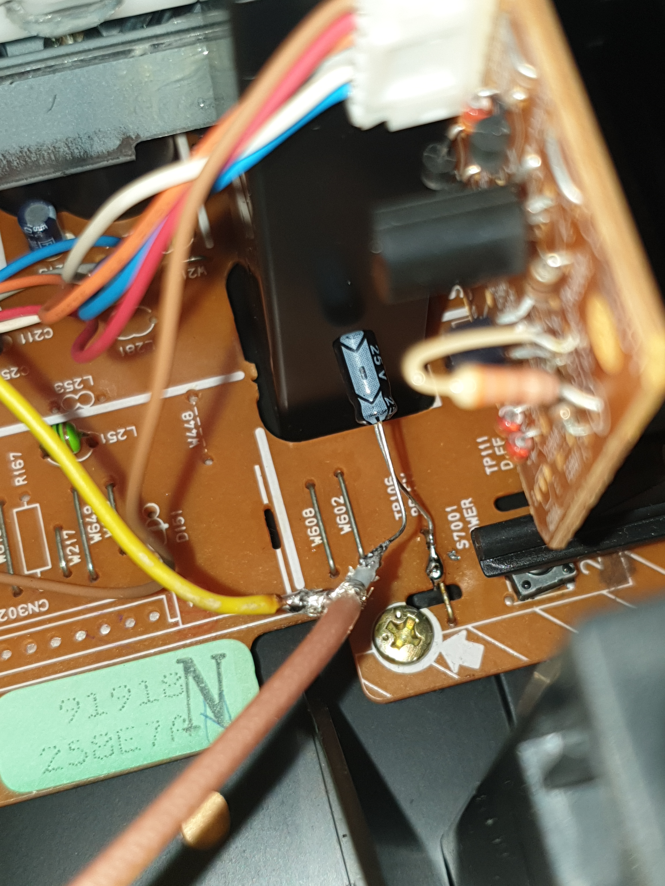
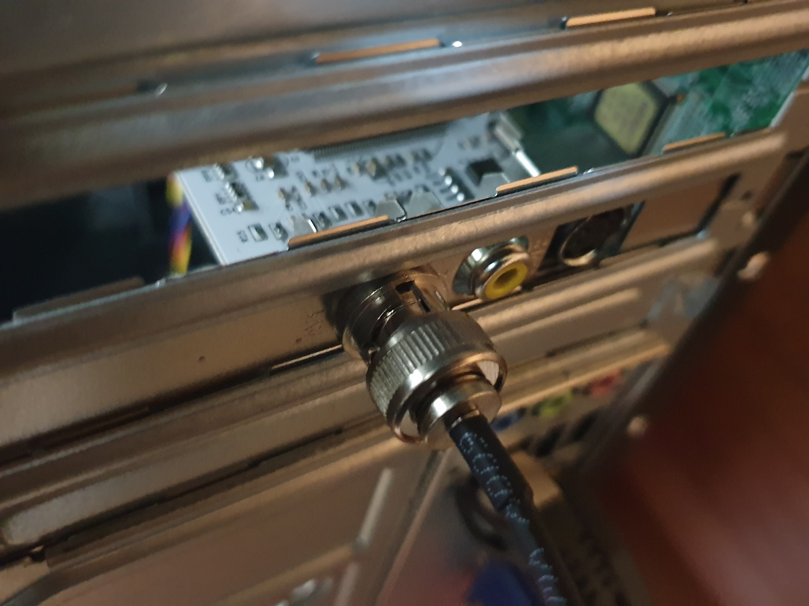

---
date:
  created: 2025-12-06
  updated: 2025-12-30
draft: false

---

# VHS-Decode - Part 1

**This tutorial is exclusively for capturing VHS tapes**

This tutorial (or rather blog) shows you start to end on how to do your very first video-only capture with vhs-decode in Linux.
Capturing audio and improving the quality will come in later parts of this blog (if I manage to understand it :laught:).
It's meant for absolute beginners, although it's assumed that you have some basic technical understanding + skills and know how to use the terminal in Linux.

## Requirements

### Skills

- Basic soldering skills
- Basic Linux & Terminal understanding (includes knowing common commands, e.g. changing directory, moving files, ...)

### Main parts

- PC with two spare PCIe slots and Linux as OS: For beginners preferred Linux Mint or at least Debian based (Linux Mint is based on Ubuntu which is based on Debian), most other distros work too, but in that case you should really know your distro.
- VCR (**V**ideo **C**assette **R**ecorder) (your VHS player)
- Optional: TV/Monitor for the VCR (just for viewing the tape during capture)

### Miscellaneous parts for vhs-decode

- Soldering iron and belonging tools

- CX Card(s) (you'll need two of them to capture video **and** audio because VHS uses two channels, but in this first test we're only going to capture video, so one is enough for now)

- BNC Female Jack Bulkhead To SMA Male SMA Plug 
  
    

- SMA Male to SMA Male (or two separate male cables with no connector at the other end, but I found it's easier to find a male to male cable and just cut it in half)
  
    

- RG316 BNC Male to BNC Male 
  
    

- BNC Female Right Angle 90 Degree Plug (make sure they look like in this image, there are lots of different variants and this is the one that fits to the CX cards) 
  
    

- 10uF Capacitor, preferred ceramic but if you have a spare electrolytic it'll do, but there you need to be aware of the polarization (or just directly go with the amplifier from the ko-fi store, but as of writing this, I haven't fully understood it myself and are just in the first capture stage) 
  
    

- Optional: 40x40mm heatsinks - for the CX Cards to prevent overheating

    

To make it clear if you're a bit overwhelmed with all the connectors: These are really only for convenience. Theoretically, just a long enough bare coaxial cable would be enough, the connectors are just for convenience to allow you unplugging it and integrating the amplifier (you don't need to know about the amplifier yet).

For all the cables you should get ones with 50 Ohm (usually specified in the product title or description).

For the length, you should just measure how much you need and order ones as short as possible to avoid interference. But don't use too short ones to avoid wiring problems later on.

## Start

Okay, so let's start.
If you're reading this and haven't ordered your parts yet or you currently wait for them to arrive, keep on reading to get a better understanding of how it works. It'll help reading this (and the official vhs-decode wiki) multiple times, with some time between. You can also do some preparation already.

First, find a place to put your VCR and (preferred dedicated) capture PC.

Take a note of your VCR model name.
Remove the cover from your VCR (most of the time the screws are on the sides and back).

#### Finding the test point

For finding the test points, you should follow the official WIKI. As said, in the first step we're only going to capture video so we just need to find the video test point, although it won't hurt searching for the audio test point too. Note that if your VCR does not have Hi-Fi audio support (most of the time it's written on the tape cover on the front of your VCR), you won't find a audio test point because this test point is ONLY for capturing the Hi-Fi (better quality) audio. Not all VCRs support that and not all tapes have Hi-Fi audio in the first place. That means if your tape doesn't have Hi-Fi audio the Hi-Fi test point will be completely useless even if your VCR has one. In that case you'll need to capture the standard way with the standard audio output at the back of the VCR.

VHS-Decode links for finding test points:

- General info: [RF Tapping · oyvindln/vhs-decode Wiki · GitHub](https://github.com/oyvindln/vhs-decode/wiki/RF-Tapping#test-point-names)
- List of already found test points (check if your model is in there): [004 The Tap List · oyvindln/vhs-decode Wiki · GitHub](https://github.com/oyvindln/vhs-decode/wiki/004-The-Tap-List)
- Reports (check if your model (or manufacturer) is in there to get more info about your model): [VCR reports · oyvindln/vhs-decode Wiki · GitHub](https://github.com/oyvindln/vhs-decode/wiki/VCR-reports)

If you can't find the test points by looking at the PCBs inside of the VCR, search the web for a service manual for your specific model.
It's not that easy to read them if you haven't read service manuals before, but it can definitively help. For example in my case there was a white connector with 6 pins on the board, but only labelled with a cryptic name. I found it in the service manuals and there was also the description what each pin does, one of them was the test point that we need.
If your service manual contains a troubleshooting section, that can be very helpful too.

Sadly, it's not always easy to find the correct service manual. If you have luck, you directly find it when searching google for your model number and writing `service manual` behind it.
You'll have issues finding it most of the time if you have a re-branded model (no main brand like JVC, Sony, ...).
In my case I have an `AGFAPHOTO DV 18909R` and I couldn't find a service manual at all.
After opening it up and removing the whole tape unit, I saw another model number printed on the mainboard. This revealed the actual manufacturer (which was Daewoo). That still wasn't enough because that model number from the mainboard didn't really exist, but luckily when typing it in google gave me a normal user manual with a VCR that looked identical to mine. And it contained the actual model number of the unit itself. All I had to do was type in this newly found model number and - I got my service manual!
All I want to say with this is, it's very likely that your service manual is somewhere out there, you just need to hunt it down.

If you still can't find the test point with the service manual, someone at the vhs-decode subreddit or on the Discord server may be able to help you.
But if ask there, you should have your service manual ready to get the best help.

#### Wiring

You've found your test point.
_If you didn't find it yet, you can skip to [CX Cards](#cx-cards)_

Get the SMA male cable with no connector on the other end. Solder that end to the capacitor.
Use the official WIKI to find out how to connect the other end of the capacitor to your test point.
Now you have a SMA male connector that goes to your test point.
Then use the other cables to extend it and to get a final BNC male output.
You can also prepare the other cable for Hi-Fi audio capture.




#### CX Cards

First find out what model you've got and if it's good: [Types Of CX2388x Cards · happycube/cxadc-linux3 Wiki](https://github.com/happycube/cxadc-linux3/wiki/Types-Of-CX2388x-Cards).
The exact model is written on the big chip on the card.
They even ship different models if you order multiple at once. For me, one had the CX23883 and the other the CX25800 chip.
The CX25800 is the slightly better one, but CX23883 seems to be fine too.
For the first video-only capture, I chose to use the CX23883 card as it had the hole for the additional connector already drilled.

Now we're going to do the following mods:

- [RCA to BNC replacement / adding](https://github.com/oyvindln/vhs-decode/wiki/CX-Cards#rca-to-bnc-replacement)
- [C31 Removal / moving](https://github.com/oyvindln/vhs-decode/wiki/CX-Cards#c31-removal)
- [Optional/Later: Cooling Mood](https://github.com/oyvindln/vhs-decode/wiki/CX-Cards#cooling-mod)

In my case I'm using the 3rd connector (and not replacing the middle connector) because one of the cards already had the hole. For the other one, I'm going to drill the hole myself.
After having the BNC connector installed, do the C31 removal (or move it to the other pad if you're using the 3rd connector like I do).

Note: I'm actually unsure if the C31 removal (and BNC Jack mod) should be done for the newer CX25800 cards because in the [Types Of CX2388x Cards](https://github.com/happycube/cxadc-linux3/wiki/Types-Of-CX2388x-Cards) wiki, recommended mods are only listed for the older CX23883. I don't know if they just forgot to add the recommended mods to the description of the newer card or if it's intentional. However, in the [CX Cards](https://github.com/oyvindln/vhs-decode/wiki/CX-Cards#rca-to-bnc-replacement) wiki, there is no differentiation between card types.

Because I will do the clockgen mod later anyway (which I really recommend to avoid sync issues) and just want to see if it's working at all right now, I'm not going to do the crystal replacement mod.

After your card is ready, install it to your capturing PC.


## The software part

### CX card driver

#### Checking if the card is recognized

After installing the driver, the card should be there as `/dev/cxadc0`.
You can check this with this command:
`ls /dev/cxadc0`
If it returns the path, your card is properly recognized! If it says the path cannot be found, something went wrong.

#### Installing the driver

For installing the driver, follow the instructions of the driver's README: [GitHub - happycube/cxadc-linux3](https://github.com/happycube/cxadc-linux3?tab=readme-ov-file#getting-started--installation)

First you must install the dependencies, download the repo to your local disk and then build it. After that, reboot and check if the card is recognized.

For installing the dependencies, If you're using a different repo than what's listed there (currently only Ubuntu 22.04 or RPi OS),  AI can help relatively good with getting the dependencies that you need to install on your distro.
In my case I've use openSUSE. Although it worked for me, I recommend just using a distro (currently Ubuntu) that's supported by the official WIKI if you use a dedicated PC.

#### Connecting the cables

Now after the driver is working, it's a good time to connect the cable with the BNC plug from your VCR to the CX card.



#### Find the correct `vmux` input

The CX cards have 3 inputs, depending on your card and which of the two RCA inputs you've used, you need to find the correct output.

For finding the correct `vmuc` input, check this wiki: [Types Of CX2388x Cards · happycube/cxadc-linux3 Wiki](https://github.com/happycube/cxadc-linux3/wiki/Types-Of-CX2388x-Cards)

To configure the correct `vmux` input, you must execute this command:
`echo 1 >/sys/class/cxadc/cxadc0/device/parameters/vmux`
Replace the number after `echo` with the input you want to use.
This is explained here as an example: [https://github.com/happycube/cxadc-linux3?tab=readme-ov-file#module-parameters](https://github.com/happycube/cxadc-linux3?tab=readme-ov-file#module-parameters)

#### Driver setup

You should read trough the driver's README to get an overview of all the things you that you can adjust. I'm not fully sure (because I played around with it because I had no signal at all at first (but at the end the issue was something else, see troubleshooting below)), but I think it's not needed and is only fine adjusting.

### Testing the signal

After successfully installing the driver, we can now finally test if we receive a signal from our VCR.
For this, we use ffplay: [https://github.com/happycube/cxadc-linux3?tab=readme-ov-file#commands-to-check-for-signal-burst](https://github.com/happycube/cxadc-linux3?tab=readme-ov-file#commands-to-check-for-signal-burst)

### Making the first capture

#### Folder structure

For initial testing, a relatively small disk is okay. But for doing longer captures, you'll need a lot of storage space.
For testing, I just made a folder in my home directory.
My folder structure as example:

```
workdir
  captures
    some-capture.u8
  decoded
    some-capture.tbc
    some-capture_chroma.tbc
    some-capture.json
    some-capture.log
  export
    some-capture.mkv
  tools
```


#### Getting required software

Download the `tbc-tools` archive and the `vhs-decode` AppImage from: [Releases · oyvindln/vhs-decode · GitHub](https://github.com/oyvindln/vhs-decode/releases/).
Extract the tbc-tools archive into your tools folder. Also place your AppImage there.

Download the `tbc-video-export` AppImage from: [Releases · JuniorIsAJitterbug/tbc-video-export · GitHub](https://github.com/JuniorIsAJitterbug/tbc-video-export/releases)

Example:

```
.
└── workdir/
    └── tools/
        ├── tbc-tools/
        │   ├── 40msps-to-10msps-8-bit-HiFi.sh
        │   ├── ld-compress
        │   ├── tbc-tools-x86_64.AppImage
        │   └── ...
        ├── vhs-decode-x86_64.AppImage
        └── tbc-video-export-v0.1.8-amd64.AppImage 
```

#### Capturing

To capture a 10 seconds clip, execute this command (execute inside of your captures folder):
`timeout 10s cat /dev/cxadc0 |pv > captures/CX_Card_28msps_8-bit.u8`

With that, you receive your capture in this file: `CX_Card_28msps_8-bit.u8`

#### Decoding

After getting the `.u8` file, we can now decode it.
In my case the command is:
`tools/vhs-decode-x86_64.AppImage vhs --debug --tape_format vhs --system pal --cxadc --threads 8 --recheck_phase captures/CX_Card_28msps_8-bit.u8 decoded/CX_Card_28msps_8-bit`

For more information, see here: [RF Capture Decoding Guide · oyvindln/vhs-decode Wiki · GitHub](https://github.com/oyvindln/vhs-decode/wiki/RF-Capture-Decoding-Guide#running-the-decoders)

Note that the output path does not have a file ending. That's because it will actually create multiple output files.

### Analysing

Now that we have our `.tbc` files, we can analyse them by starting `ld-analyse` (this opens a GUI, it will throw an error if you're doing it over SSH):
`tools/tbc-tools/tbc-tools-x86_64.AppImage decoded/CX_Card_28msps_8-bit.tbc`

Hint: If it's only black & white, press the `Source` button in the bottom right menu bar to switch to chroma mode

#### Exporting

Run the export command: `tools/tbc-video-export.AppImage --tbc-tools-appimage tools/tbc-tools/tbc-tools-x86_64.AppImage decoded/tape-2025-12-06.01.tbc`

Move the exported file to the export folder:`mv decoded/*.mkv export`

#### Finished!

You can now watch your `.mkv` file!
But as explained at the beginning, we don't have any audio yet and the quality can probably be improved by tuning hardware & software.

Although it isn't needed yet in the testing stage, I still want to mention that you can use tools like `Handbrake` to encode your `.mkv` file to make it smaller (depending on the settings you'll lose quality the more you compress it at the reward of disk space).


## Troubleshooting

### Very bad results

When I tried to preview the signal with ffplay and did my first capture, the results were very bad (unusable).
But I've just made the very dumb mistake that I did not ground it properly. I just soldered the cable to the video test point but did not solder to the shielding. I'm actually surprised that it worked at all and that it not went up in smokes.
To ground it properly, just solder the cable's shielding to some metal inside the VCR. In my case I've used the metal box of the TV signal in/output, you can see the yellow cable in my wiring images above.


### No signal at all / ffplay shows no noise

_Note: If you've got a good connection and no tape is playing, it's normal that there is no noise._
I've had a really weird issue that after powering on / rebooting the PC, there is just no signal at all. No noise. Nothing.
Accidentally I found how to make it work: I need to put the PC to sleep (suspend) and then wake it up again. After that, the card works.